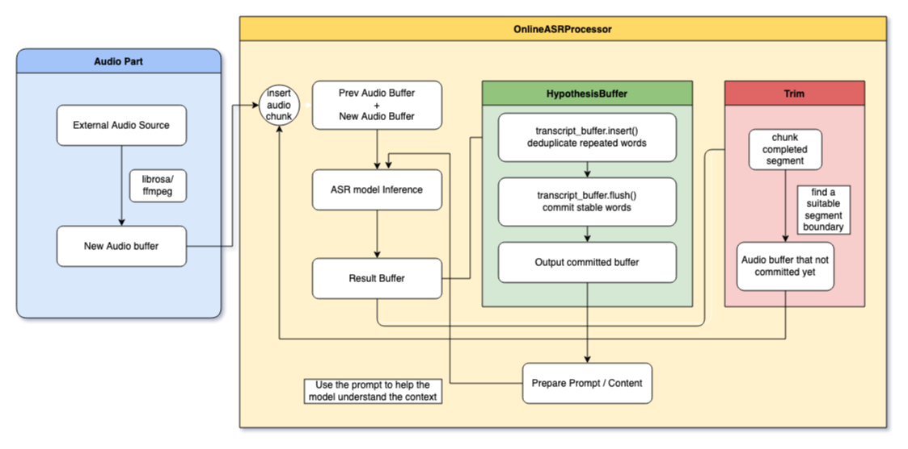

# Whisper Streaming Practice

---

## 🚀 Overview

A hands-on practice repo for learning and extending [Whisper Streaming](https://github.com/ufal/whisper_streaming) — OpenAI Whisper models adapted for real-time, long-form speech-to-text transcription.

This project aims to understand, customize, and eventually package `whisper_streaming` for use in desktop apps, web services, toolkits, and other real-world applications.
