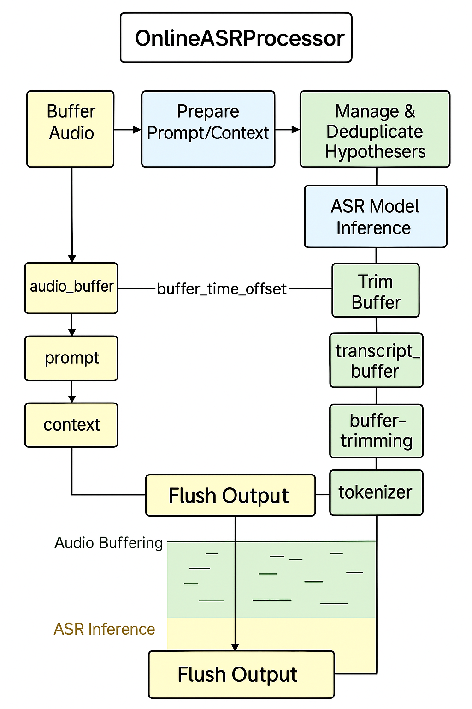

# OnlineASRProcessor

---

> This diagram illustrates how audio and text are processed in chunks:
> - Audio is appended and processed via ASR.
> - `HypothesisBuffer` deduplicates overlapping hypotheses.
> - Confirmed chunks are returned; long segments are trimmed.
> - The system continues streaming until `finish()` is called.

## 🚀 Overview

`OnlineASRProcessor` is a real-time streaming Automatic Speech Recognition (ASR) processor built for handling live audio input and generating non-redundant transcription output using a backend ASR model (e.g., Whisper).

### 🔹 Key Features

- Buffer streaming audio and track its timing offset.
- Use previous transcripts as prompt/context for the ASR engine.
- Deduplicate and commit confirmed hypotheses via [HypothesisBuffer](./HypothesisBuffer.md).
- Automatically trim audio and transcript buffer based on configurable strategies.
- Handle finalization when audio input ends.

### 📖 Core Components

| Component | Description |
|----------|-------------|
| `audio_buffer` | Raw audio stream accumulated between chunks |
| `transcript_buffer` | `HypothesisBuffer` instance managing partial and committed transcripts |
| `commited` | Fully confirmed transcribed output stored as (start, end, text) tuples |
| `buffer_time_offset` | Current offset applied to all timing calculations |
